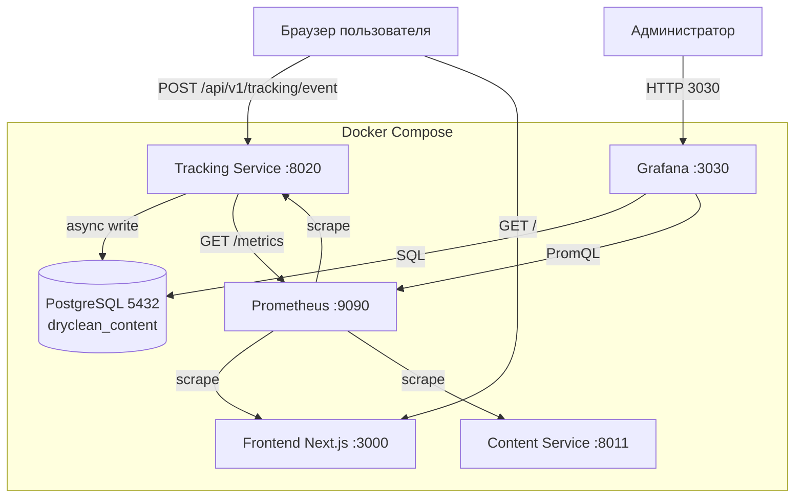
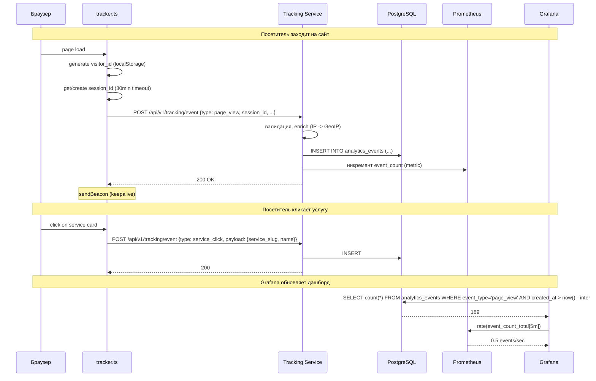

# ADR-001: Архитектура трекинга бизнес-метрик и дашборда Grafana

**Дата:** 2026-06-01
**Статус:** Proposed
**Контекст:** Необходимо добавить на сайт D&A Dry Cleaning аналитику поведения посетителей: отслеживание просмотров, кликов по услугам, телефонам, мессенджерам, отправку форм. Построить дашборд в Grafana для визуализации бизнес-метрик в реальном времени.

---

## Решение

Создать новый микросервис **Tracking Service** (FastAPI, порт 8020) с собственной таблицей `analytics_events` и `analytics_sessions` в существующей PostgreSQL БД `dryclean_content`. Данные агрегируются через SQL-запросы из Grafana (PostgreSQL datasource). Системные метрики собираются Prometheus. Дашборды Grafana настраиваются через provisioning (YAML + JSON).

**Три ключевых компонента:**
1. **Tracking Service** — приём событий, Prometheus metrics, async запись в БД
2. **Prometheus** — сбор системных метрик (event_count, latency, error_rate)
3. **Grafana** — дашборды через PostgreSQL + Prometheus datasources

---

## Альтернативы

### Вариант А: Отдельный сервис Tracking Service (ВЫБРАН)

| Плюсы | Минусы |
|-------|--------|
| Чистое разделение ответственности | Дополнительный контейнер в docker-compose |
| Не влияет на Content Service | Дополнительные ресурсы (RAM 128MB) |
| Можно масштабировать независимо | Небольшая задержка (HTTP roundtrip) |
| Prometheus метрики изолированы | |
| Просто тестировать | |

**Оценка:** 9/10

### Вариант Б: Встроить трекинг в Content Service

| Плюсы | Минусы |
|-------|--------|
| Меньше контейнеров | Смешение ответственности (контент + аналитика) |
| Одна БД, общий connection pool | Content Service может лечь под нагрузкой от трекинга |
| Минимальная задержка (in-process) | Prometheus метрики смешиваются |
| | Сложнее тестировать |

**Оценка:** 6/10

### Вариант В: Использовать Yandex Metrika / Google Analytics

| Плюсы | Минусы |
|-------|--------|
| Не нужно разрабатывать | Данные на стороннем сервере (GDPR/152-ФЗ) |
| Бесплатно для малого бизнеса | Нет интеграции с нашими системами |
| Готовые дашборды | Нельзя объединить с нашими данными (заказы) |
| | Ограниченная кастомизация |

**Оценка:** 5/10

### Вариант Г: Отдельная БД ClickHouse для аналитики

| Плюсы | Минусы |
|-------|--------|
| Максимальная производительность агрегации | Тяжеловесное решение для 100-500 посетителей/день |
| Хорошо для временных рядов | Дополнительный инфраструктурный компонент |
| | Необходимость синхронизации данных |

**Оценка:** 4/10

---

## Обоснование выбора

Выбран Вариант А (отдельный Tracking Service), так как:
1. **Чистая архитектура** — трекинг не смешивается с управлением контентом
2. **Изоляция сбоев** — падение трекинга не влияет на сайт
3. **Масштабируемость** — при росте трафика можно выделить отдельный инстанс
4. **Наблюдаемость** — собственные метрики, понятные логи
5. **Технологическая согласованность** — FastAPI + PostgreSQL, как и все сервисы

База данных PostgreSQL выбрана вместо ClickHouse из-за простоты (уже есть PostgreSQL в проекте). Для текущего объёма трафика (сотни посетителей/день) это оптимально.

---

## Влияние на архитектуру

### Затронутые микросервисы

| Компонент | Статус | Изменение |
|-----------|--------|-----------|
| `backend/services/tracking` | **Новый** | Tracking Service на FastAPI |
| `prometheus` | **Новый** | Система сбора метрик |
| `grafana` | **Новый** | Бизнес-дашборды |
| `postgres` | Существующий | +2 таблицы (analytics_events, analytics_sessions) |
| `frontend` | Существующий | +tracker.ts, изменения в 6 компонентах |

### Архитектурная диаграмма



### Sequence diagram: Обработка события



### База данных

**Database:** `dryclean_content` (существующая)
**Новые таблицы:**

```sql
-- Таблица событий
CREATE TABLE IF NOT EXISTS analytics_events (
    id UUID PRIMARY KEY DEFAULT gen_random_uuid(),
    session_id UUID NOT NULL,
    visitor_id VARCHAR(100) NOT NULL,
    event_type VARCHAR(50) NOT NULL,
    event_name VARCHAR(100),
    payload JSONB NOT NULL DEFAULT '{}',
    page_url TEXT,
    referrer TEXT,
    referrer_group VARCHAR(50),
    user_agent TEXT,
    ip_address INET,
    geo_city VARCHAR(100),
    geo_country VARCHAR(100),
    created_at TIMESTAMPTZ NOT NULL DEFAULT NOW()
);

CREATE INDEX idx_events_type_time ON analytics_events(event_type, created_at DESC);
CREATE INDEX idx_events_session ON analytics_events(session_id);
CREATE INDEX idx_events_created ON analytics_events(created_at DESC);
CREATE INDEX idx_events_payload ON analytics_events USING GIN (payload);

-- Таблица сессий
CREATE TABLE IF NOT EXISTS analytics_sessions (
    id UUID PRIMARY KEY DEFAULT gen_random_uuid(),
    session_id UUID NOT NULL UNIQUE,
    visitor_id VARCHAR(100) NOT NULL,
    first_page_url TEXT,
    referrer TEXT,
    referrer_group VARCHAR(50),
    user_agent TEXT,
    ip_address INET,
    geo_city VARCHAR(100),
    geo_country VARCHAR(100),
    page_views_count INTEGER DEFAULT 1,
    started_at TIMESTAMPTZ NOT NULL DEFAULT NOW(),
    last_activity_at TIMESTAMPTZ NOT NULL DEFAULT NOW(),
    ended_at TIMESTAMPTZ,
    duration_seconds INTEGER DEFAULT 0
);

CREATE INDEX idx_sessions_visitor ON analytics_sessions(visitor_id);
CREATE INDEX idx_sessions_started ON analytics_sessions(started_at DESC);
CREATE INDEX idx_sessions_group ON analytics_sessions(referrer_group);
```

### API

#### POST /api/v1/tracking/event
Публичный, без аутентификации. Rate limit: 100 req/sec/IP.

```python
class EventCreate(BaseModel):
    session_id: UUID
    visitor_id: str = Field(max_length=100)
    event_type: Literal["page_view", "service_click", "phone_click", "messenger_click", "form_submit"]
    event_name: str | None = None
    payload: dict[str, Any] = Field(default_factory=dict)
    page_url: str | None = None
    referrer: str | None = None
```

#### GET /api/v1/tracking/stats?period=24h
Внутренний, для отладки. Основной источник данных для Grafana — прямой SQL.

#### GET /metrics
Prometheus metrics endpoint.

### RabbitMQ Events
Не используются. Трекинг — fire-and-forget через HTTP.

### Backward Compatibility
- Новые таблицы не затрагивают существующие
- Новый сервис не имеет точек интеграции с существующими (кроме общей БД)
- Frontend-трекер работает через `sendBeacon` — не блокирует UI

### Observability
- Tracking Service: structured JSON logs (structlog), /health, /metrics
- Prometheus: event_count_total (counter), event_duration_seconds (histogram), event_errors_total (counter)
- Grafana: панель «Здоровье сервиса» (up, latency, error rate)

### Security
- Tracking API: публичный, CORS ограничен доменом сайта
- Rate limiting: 100 req/sec/IP (через slowapi)
- IP-адреса не маскируются (для GeoIP), могут быть удалены при очистке (90 дней)
- Grafana: basic auth + admin/admin (локальная сеть)

### Структура файлов

```
backend/services/tracking/
├── Dockerfile
├── pyproject.toml
├── alembic/
│   ├── env.py
│   ├── versions/
│   │   └── 001_create_analytics_tables.py
│   └── alembic.ini
├── app/
│   ├── __init__.py
│   ├── main.py
│   ├── config.py
│   ├── api/v1/
│   │   ├── __init__.py
│   │   ├── router.py
│   │   └── endpoints/
│   │       ├── __init__.py
│   │       ├── track.py
│   │       └── stats.py
│   ├── schemas/
│   │   ├── __init__.py
│   │   ├── event.py
│   │   └── stats.py
│   ├── services/
│   │   ├── __init__.py
│   │   └── analytics.py
│   ├── models/
│   │   ├── __init__.py
│   │   ├── base.py
│   │   └── analytics.py
│   ├── core/
│   │   ├── __init__.py
│   │   ├── database.py
│   │   ├── metrics.py
│   │   └── geo.py
│   └── tasks/
│       ├── __init__.py
│       └── cleanup.py
└── tests/
    ├── __init__.py
    ├── conftest.py
    ├── test_track.py
    ├── test_stats.py
    └── test_models.py
```

### Pydantic модели

```python
class EventCreate(BaseModel):
    session_id: UUID
    visitor_id: str = Field(max_length=100)
    event_type: Literal["page_view", "service_click", "phone_click", "messenger_click", "form_submit"]
    event_name: str | None = None
    payload: dict[str, Any] = Field(default_factory=dict)
    page_url: str | None = None
    referrer: str | None = None

class EventResponse(BaseModel):
    event_id: UUID
    created_at: datetime

class StatsResponse(BaseModel):
    visitors: int
    unique_visitors: int
    page_views: int
    bounce_rate: float
    avg_duration_seconds: float
    avg_pages_per_session: float
    service_clicks: dict[str, int]
    phone_clicks: dict[str, int]
    messenger_clicks: dict[str, int]
    form_submits: dict[str, Any]
    sources: dict[str, int]
    top_cities: list[dict]
    hourly_distribution: dict[str, int]
```

---

## Риски и митигация

| Риск | Вероятность | Влияние | Митигация |
|------|-------------|---------|-----------|
| AdBlock блокирует трекинг | Высокая | Потеря до 30% событий | sendBeacon + fallback fetch; событие не критично для работы сайта |
| PostgreSQL перегружена вставками | Низкая (< 1 rps) | Среднее | Batch insert, connection pool, keepalive |
| Prometheus потребляет память | Средняя | Низкое | Retention 15 дней, block size 2h |
| GeoIP база устарела | Средняя | Низкое | Обновление через makefile/скрипт раз в месяц |
| Забыт пароль Grafana | Средняя | Среднее | Provisioning через config (admin/admin), можно сбросить |

---

## Критерии успеха

- [ ] POST /api/v1/tracking/event отвечает < 50ms (p95)
- [ ] Дашборд Grafana отображает данные с задержкой < 60 сек
- [ ] Все 6 типов событий сохраняются в analytics_events
- [ ] Frontend-трекер не влияет на Core Web Vitals (LCP, CLS, INP)
- [ ] docker-compose up — все 3 новых сервиса (tracking, prometheus, grafana) запускаются и healthy
